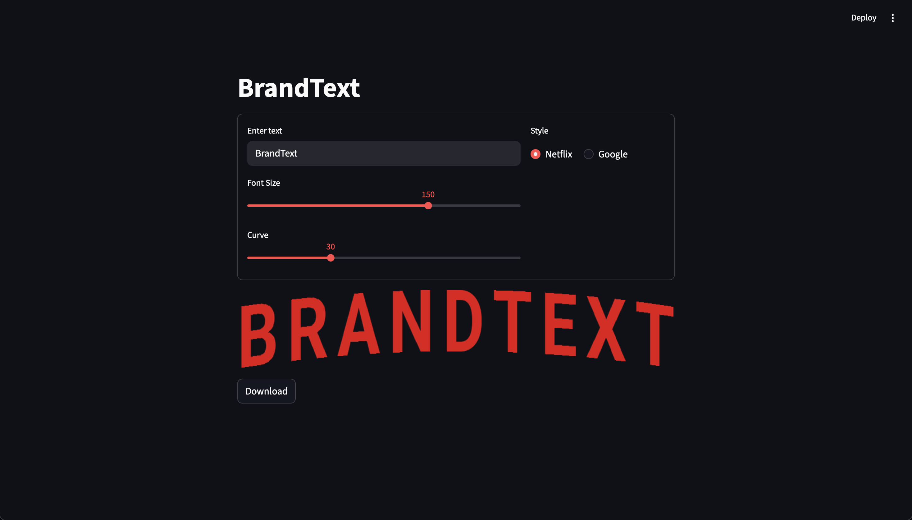

# BrandText

[English](#english) | [中文](#中文)

---

<div id="english"></div>

## Introduction

BrandText is a Streamlit-based text image generator. Users can input text and select a style to generate a corresponding image.

<p align="center">
   
</p>

## File Structure
```text
├── main.py          
├── requirements.txt     
├── fonts/              
│   ├── Roboto-Bold.ttf
│   ├── GoogleSansFlex.ttf
│   └── PlusJakartaSans-Bold.ttf
└── styles/              
    ├── g.py             
    └── n.py
```

## Execution and Installation
1. Install dependencies
   ```bash
   pip install -r requirements.txt
   ```
2. Run the application
   ```bash
   streamlit run main.py
   ```

## Notes
- Some of the rendering logic and code in this project were developed with the assistance of AI.
- The fonts used in this project are from Google Fonts and are included in the `fonts` folder.
---

<div id="中文"></div>

## 簡介

 BrandText是一個基於Streamlit的文字圖片生成器，使用者可以輸入文字並選擇風格，生成對應的圖片。

<p align="center">
   
</p>

## 檔案結構
```
├── main.py          
├── requirements.txt     
├── fonts/              
│   ├── Roboto-Bold.ttf
│   ├── GoogleSansFlex.ttf
│   └── PlusJakartaSans-Bold.ttf
└── styles/              
    ├── g.py             
    └── n.py             
```

## 執行與安裝
1. 安裝套件
   ```bash
   pip install -r requirements.txt
   ```
2. 執行應用程式
   ```bash
   streamlit run main.py
   ```

## 備註
- 本專案的部分渲染邏輯與程式碼是在AI的協助下完成開發。
- 本專案的字體來自Google Fonts，已包含在`fonts`資料夾中。
